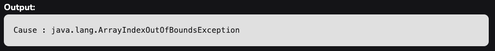

Throwable sınıfının initCause() metodu, bu Throwable'ın sebebini, initCause() metoduna parametre olarak geçirilen
belirli bir sebeple başlatmak için kullanılır.

Aslında, sebep, bir exception oluştuğunda bu Throwable nesnesinin atılmasına neden olan Throwable nesnesidir. Bu method
yalnızca bir kez çağrılabilir. Genellikle bu method, yapıcı (constructor) içinden veya Throwable oluşturulduktan hemen
sonra çağrılır. Eğer çağrılan Throwable, Throwable(Throwable) veya Throwable(String, Throwable) kullanılarak
oluşturulmuşsa, bu method bir kez bile çağrılamaz.


**parametreler**: Bu yöntem, bu Throwable Nesnesinin nedenini temsil eden bir parametre olarak cause nesnesini kabul
eder.

**returns:** Bu method, bu Throwable instance'ina bir reference döndürür.

**exception:** Bu method throw eder

Cause bu throwable ise IllegalArgumentException.

Bu throwable, Throwable(Throwable) veya Throwable(String, Throwable) ile oluşturulmuşsa veya bu method bu throwable
üzerinde zaten çağrılmışsa IllegalStateException.

### Example One

```
public class ThrowableInitCause {
    public static void main(String[] args) {
        try {
            testException1();
        } catch (Throwable e) {
            System.out.println("Cause : " + e.getCause());
        }
    }

    public static void testException1() throws Exception {
        /* Bu exception, başka bir exception'ın Cause'u olarak kullanılacaktır */
        ArrayIndexOutOfBoundsException arrayIndexOutOfBoundsException = new ArrayIndexOutOfBoundsException();

        Exception ioe = new Exception();

        /* Cause'u initialize eder ve Exception throw eder */
        ioe.initCause(arrayIndexOutOfBoundsException);

        throw ioe;
    }
}
```



### Example Two

```
public class ThrowableInitCause {
    public static void main(String[] args) {
        try {
            addPositiveNumbers(2,-1);
        } catch (Throwable e) {
            System.out.println("Cause : " + e.getCause());
        }
    }

    public static int addPositiveNumbers(int a, int b) throws Exception {
       if (a < 0 || b < 0){

           /* Sayilar pozitif olmadiginda
           * Bu exception, başka bir exception'ın Cause'u olarak kullanılacaktır
           * */
           Exception ex = new Exception("Numbers are not positive");

           Exception anotherEx = new Exception();

           anotherEx.initCause(ex);

           throw anotherEx;
       }

       else {
           return a + b;
       }
    }
}
```

### Example Three

```
public class ThrowableInitCause {
    public static void main(String[] args) {
        try {
            String text = null;
            text.length();
        } catch (NullPointerException exception){
            Throwable t = exception.getCause();
            System.out.println("Cause is: " + exception.getCause());

            exception.initCause(null);

            exception.initCause(new ArithmeticException("This is the cause"));
        }
    }
}
```